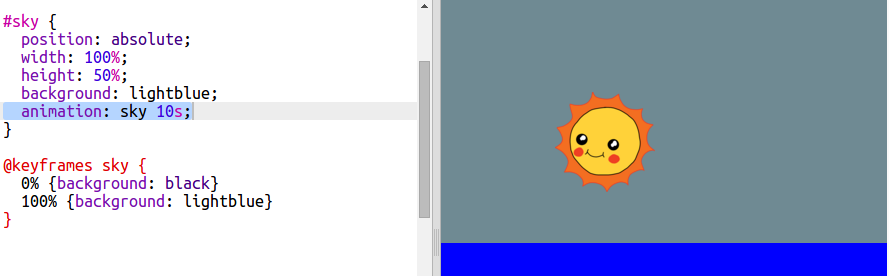

## Den Himmel animieren

Die Animation gilt nicht nur für Bewegungen. Lass uns den Himmel so animieren, dass er nachts dunkel wird.

+ Füge eine Animation namens `sky` (Himmel) zu deinem CSS hinzu:

    ```
    @keyframes Himmel {
        0% {Hinergrund: schwarz }
        100% {Hintergrund: hellblau}
    }
    ```

    Beachte bitte, dass du diesmal die Farbe des Himmels animierst und nicht die Position.

+ Füge den Code zu deinem Himmel hinzu, um ihm mitzuteilen, deine neue Animation zu benutzen:

    ```
    Animation: Himmel 10s;
    ```

    

+ Klicke auf **Autorun**, um deine Animation zu testen. 


