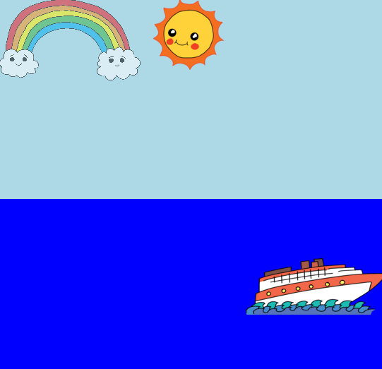

--- challenge ---
## Aufgabe: Noch mehr Animationen

Kannst du ein weiteres Bild animieren? Du kannst die Position, die Farbe, die Form, die Größe, die Opaziät (Durchsichtigkeit) oder alles andere mögliche, das dir einfällt, animieren. Probiere auch mal, ob du die Länge der Zeit, in der deine Animationen laufen sollen, ändern kannst. 

Für jedes Ding, das du animieren willst, musst du:

+ es mit einer ID in dein HTML mit einbeziehen
+ einen Stil für die ID hinzufügen
+ eine „@keyframes” Regel aufstellen
+ Benutze `animation:` in dem Stil, um die Animation zu benutzen, die du mit „@keyframes“ definiert hast. 

Klicke auf das Bildsymbol, um die Bilder zu sehen, die in diesem Projekt mit enthalten sind:


Du kannst, wenn du willst, auch deine eigenen Bilder hochladen. 

Vergiss nicht, dass du Dinge auch im Meer, bzw. im Himmel platzieren kannst:



In dem Beispiel hier benutzt der Regenbogen die Opazität für diesen Ausblendungseffekt:

```
@keyframes ausblenden {
  0%   {Opazität: 0;}
  50%  { Opazität: 100;}
  66%  { Opazität: 0;}
  100%   {Opazität: 0;}
}
```

Das Boot benutzt eine negative Startposition, damit du es für einen gewissen Teil der Animation nicht sehen kannst:

```
 @keyframes links-rechts {
  0%    {links:-50%;}
  100%  {links:200%;}
}
```


--- /challenge ---