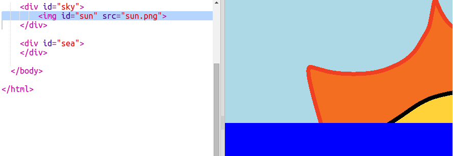

## Δημιουργία του ήλιου

Ας ξεκινήσουμε προσθέτοντας μια εικόνα για τον ήλιο και τοποθετώντας τη με χρήση κώδικα CSS.

+ Άνοιξε αυτό το trinket: <a href="http://jumpto.cc/web-sunrise" target="_blank">jumpto.cc/web-sunrise</a>.
    
    Το έργο πρέπει να μοιάζει έτσι:
    
    

+ Δες μέσα στο `body` του αρχείου `index.html` και θα βρεις τις ετικέτες `div` για τον ουρανό και τη θάλασσα.
    
        

        

        
        

        

        

+ Στο έργο περιλαμβάνεται μια εικόνα για τον ήλιο.
    
    Πρόσθεσε την εικόνα ανάμεσα στην ετικέτα `div` για τον ήλιο συμπεριλαμβάνοντας και μια id ώστε να ρυθμίσεις το στυλ της:
    
    

+ Whoa, the image is huge. Go to `style.css` and add the CSS to set the image height:
    
    
    
    Note that the width is updated automatically to keep the proportions the same.

+ Finally, let's add some code to position the sun:
    
    