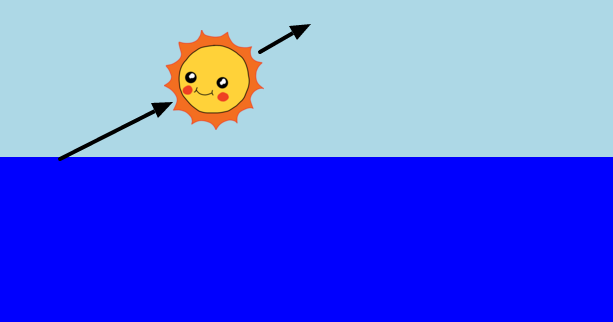

--- challenge ---

## Πρόκληση: Διαγώνια κίνηση

Μπορείς να προσθέσεις κώδικα στην μεταβολή `sunrise`, ώστε ο ήλιος να ξεκινά στην κάτω αριστερή γωνία του ουρανού και να κινείται διαγώνια προς το κέντρο της πάνω πλευράς;

Μπορείς να χρησιμοποιήσεις την ιδιότητα `left`, για παράδειγμα:

    left: 40%˙
    

--- /challenge ---