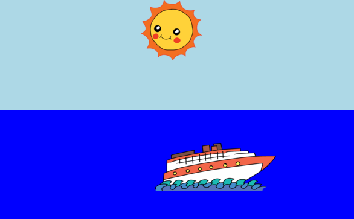

## Introduction

In this project, you'll learn how to use CSS to create an animated sunrise.

<iframe src="https://editor.raspberrypi.org/en/embed/viewer/sunrise-complete" width="600" height="400" frameborder="0" marginwidth="0" marginheight="0" allowfullscreen>
</iframe>

### Additional information for club leaders

If you need to print this project, please use the [Printer friendly version](https://projects.raspberrypi.org/en/projects/sunrise/print).

--- collapse ---
---
title: Club leader notes
---

## Introduction:

In this project, children will to learn how to animate a simple scene using CSS. They will use the CSS @keyframes rule to animate various properties of images and divs.

## Online Resources

We recommend using the [Raspberry Pi Code Editor](https://editor.raspberrypi.org/) to write HTML & CSS online. This project contains the following projects:

+ ['Sunrise' starting point](https://editor.raspberrypi.org/en/sunrise-starter)

Children can also make use of the blank editor project [here](https://editor.raspberrypi.org/), or alternatively they can use the template project [here](https://editor.raspberrypi.org/).

There is also a project containing a sample solution to the challenges:

+ ['Sunrise' Finished](https://editor.raspberrypi.org/en/sunrise-complete)

## Offline Resources

This project can be [completed offline](https://rpf.io/html-offline) if preferred. You can access the project resources by clicking the 'Download Project Materials' link for this project. This link contains a 'Project Resources' folder, which includes resources that children will need to complete this project offline. Make sure that each child has access to a copy of these resources. This folder includes the following files:
 
+ template/index.html
+ template/prefix.js
+ template/style.css
+ sunrise/index.html
+ sunrise/style.css
+ sunrise/prefixfree.js
+ sunrise/boat.png
+ sunrise/cloud.png
+ sunrise/helicopter.png
+ sunrise/rainbow.png
+ sunrise/sun.png

You can also find a completed version of this project's challenges in the 'Volunteer Resources' section, which contains:

+ sunrise-finished/index.html
+ sunrise-finished/style.css
+ sunrise-finished/prefixfree.js
+ sunrise-finished/boat.png
+ sunrise-finished/sun.png
+ sunrise-finished/rainbow.png

## Learning Objectives

+ Styling and animation with CSS:
	+ Introducing `@keyframes` rule for defining steps in an animation.
	+ Reinforcing the use of properties to define the size, shape, position and colour of elements on a webpage.

This project covers elements from the following strands of the [Raspberry Pi Digital Making Curriculum](http://rpf.io/curriculum):

+ [Design basic 2D and 3D assets](https://www.raspberrypi.org/curriculum/design/creator).

## Challenges

+ "Diagonal animation" - editing animation `@keyframe` properties to use left:;
+ "Improve the sky" - add more keyframes and setting background:.
+ "More animation" - animate more images or elements using a variety of CSS properties. 

## Frequently Asked Questions

+ This project makes use of the javascript `prefixfree.js` library, to allow animation compatibility between browsers. If this library isn't used, then children using older browsers will instead need to declare an animation in their `style.css` file, for example:

--- code ---
---
language: css
line_numbers: false
---
animation: sky 10s infinite;            //for all newer browsers
-webkit-animation: sky 10s infinite;   // For Webkit browsers(Chrome, Safari...)
-moz-animation: sky 10s infinite;      // For Mozilla browsers
-o-animation: sky 10s infinite;        // For Opera browsers
-ms-animation: sky 10s infinite;       // For Microsoft browsers
--- /code ---

--- /collapse ---

--- collapse ---
---
title: Project materials
---

## Project resources

* [.zip file containing all project resources](https://github.com/raspberrypilearning/sunrise/raw/master/en/resources/sunrise-project-resources.zip)
* [Online editor project containing all 'Sunrise' project resources](https://editor.raspberrypi.org/)
* [Online editor template](https://editor.raspberrypi.org/)
* [Online blank editor project](https://editor.raspberrypi.org/)
* [template/index.html](https://github.com/raspberrypilearning/sunrise/raw/master/en/resources/template-index.html)
* [template/style.css](https://github.com/raspberrypilearning/sunrise/raw/master/en/resources/template-style.css)
* [intro/index.html](https://github.com/raspberrypilearning/sunrise/raw/master/en/resources/intro-index.html)
* [intro/style.css](https://github.com/raspberrypilearning/sunrise/raw/master/en/resources/intro-style.css)
* [sunrise/index.html](https://github.com/raspberrypilearning/sunrise/raw/master/en/resources/sunrise-index.html)
* [sunrise/style.css](https://github.com/raspberrypilearning/sunrise/raw/master/en/resources/sunrise-style.css)
* [sunrise/prefixfree.js](https://github.com/raspberrypilearning/sunrise/raw/master/en/resources/sunrise-prefixfree.js)
* [sunrise/sun.png](https://github.com/raspberrypilearning/sunrise/raw/master/en/resources/sunrise-sun.png)
* [sunrise/rainbow.png](https://github.com/raspberrypilearning/sunrise/raw/master/en/resources/sunrise-rainbow.png)
* [sunrise/cloud.png](https://github.com/raspberrypilearning/sunrise/raw/master/en/resources/sunrise-cloud.png)
* [sunrise/boat.png](https://github.com/raspberrypilearning/sunrise/raw/master/en/resources/sunrise-boat.png)
* [sunrise/helicopter.png](https://github.com/raspberrypilearning/sunrise/raw/master/en/resources/sunrise-helicopter.png)

## Club leader resources

* [.zip file containing all completed project resources](https://github.com/raspberrypilearning/sunrise/raw/master/en/resources/sunrise-volunteer-resources.zip)
* [Online completed editor project](https://editor.raspberrypi.org/en/sunrise-complete)
* [sunrise-finished/index.html](https://github.com/raspberrypilearning/sunrise/raw/master/en/resources/sunrise-finished-index.html)
* [sunrise-finished/style.css](https://github.com/raspberrypilearning/sunrise/raw/master/en/resources/sunrise-finished-style.css)
* [sunrise-finished/prefixfree.js](https://github.com/raspberrypilearning/sunrise/raw/master/en/resources/sunrise-finished-prefixfree.js)
* [sunrise-finished/sun.png](https://github.com/raspberrypilearning/sunrise/raw/master/en/resources/sunrise-finished-sun.png)
* [sunrise-finished/boat.png](https://github.com/raspberrypilearning/sunrise/raw/master/en/resources/sunrise-finished-boat.png)
* [sunrise-finished/rainbow.png](https://github.com/raspberrypilearning/sunrise/raw/master/en/resources/sunrise-finished-rainbow.png)

--- /collapse ---
