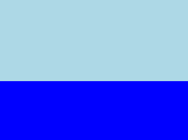
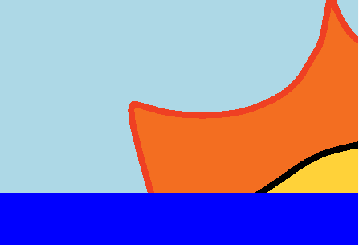
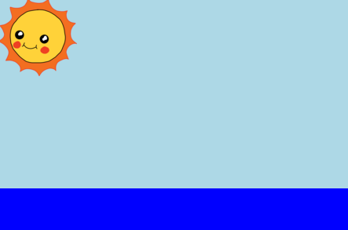
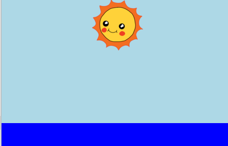

## Creating the sun

Start by adding an image for the sun and positioning it with some CSS.

+ Open this starter code: <a href="ADD" target="_blank">ADD</a>. 

    The project should look like this:

	

+ Look inside the `body` of your `index.html` file and you'll find the the `div` elements for the sky and the sea.

    --- code ---
    ---
    language: html
    line_numbers: false
    ---
    

    

    
    

    

    --- /code ---

+ An image for the sun is already included in your project. 

    Add the image inside your sun `div` including an id so you can style it:

    

    --- code ---
    ---
    language: html
    line_numbers: false
    ---
    

      
    

    --- /code ---

+ Whoa, the image is huge. Go to `style.css` and add the CSS to set the image height:

    

    --- code ---
    ---
    language: css
    line_numbers: false
    ---
    #sun {
      height: 100px;
    }
    --- /code ---

    Note that the width is updated automatically to keep the proportions the same. 

+ Finally, let's add some code to position the sun:

    

    --- code ---
    ---
    language: css
    line_numbers: false
    ---
    #sun {
      height: 100px;
      position: absolute;
      top: 0;
      left: 40%;
    }
    --- /code ---

