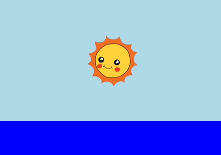

## Animating the sunrise

To animate your sunrise, you need to define how the sun moves and how long it takes to rise.

To do this you define a list of __key frames__. Each key frame defines the CSS properties of an element at a particular point in an animation. 


+ First, you need to use `@keyframes` to create a new animation called sunrise. 

    Add this CSS code to the end of your `style.css` file:

    ```
    @keyframes sunrise {
        0%
        100%
    }
    ```

    This code tells the sun where to position itself at the start (`0%`) and the end (`100%`) of the animation.

    Because the sun is inside the sky `div`, the `top` and `left` positions you give are within to the sky, with `top: 100%` being the bottom of the sky, and not the bottom of the webpage.


+ Now that you have created a `sunrise` animation, you just need to tell your sun to use it! 

    Add the highlighted code to your sun's CSS:

    

    This tells the sun to spend 10 seconds animating a sunrise.

+ To run the animation again in Trinket, just click **Autorun**. 


