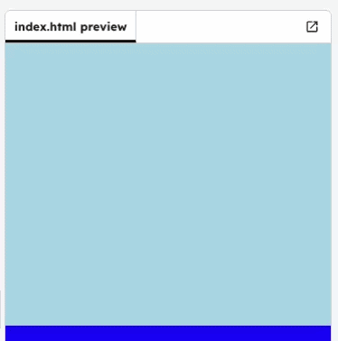

## Infinite animation

Let's make the animation keep repeating forever.

+ If you want the sun to rise and then set, just add more keyframes to your animation:

    --- code ---
    ---
    language: css
    line_numbers: false
    ---
    @keyframes sunrise {
        0% { top: 90%; left: 0; }
        33% { top: 0; left: 40%; }
        66% { top: 0; left: 40%; }
        100% { top: 90%; left: 80%; }
    }
    --- /code ---

    This means that the animation starts and ends with the sun at the bottom of the sky, and stays at the top from 33% until 66% of the animation.

+ Now you just need to add the word `infinite` to the `#sun` animation to make it loop forever:

    --- code ---
    ---
    language: css
    line_numbers: false
    ---
    #sun {
        height: 100px;
        position: absolute;
        top: 100%;
        left: 40%;
        animation: sunrise 10s infinite;
    }
    --- /code ---
    

+ Test out your animation. Does the sun keep rising and setting? 
