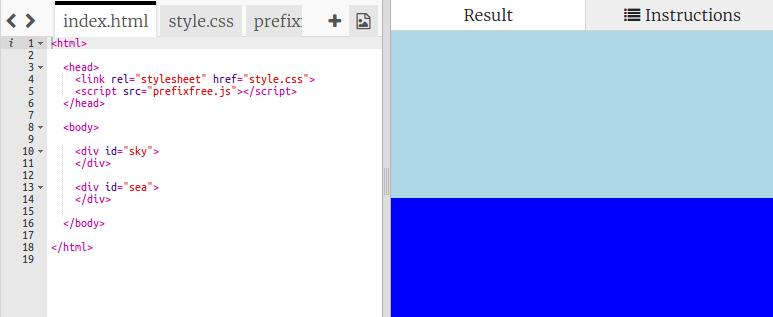

## Creando el Sol

Empecemos añadiendo una imagen para el sol y colocándola con CSS.

+ Abre este Trinket: <a href="http://jumpto.cc/web-sunrise" target="_blank">jumpto.cc/web-sunrise</a>.
    
    El proyecto debería parecerse a esto:
    
    

+ Mira dentro de `body` en tu archivo `index.html` y encontrarás los elementos `div` para el cielo y el mar.
    
        

        

        
        

        

        

+ Una imagen para el sol ya está incluida en tu proyecto.
    
    Añade la imagen dentro del `div` de tu sol incluyendo un id de manera que puedas darle diferentes estilos:
    
    

+ ¡Hala!, la imagen es gigante. Ve a `style.css` y añade el código CSS para establecer la altura de la imagen:
    
    
    
    Date cuenta de que la anchura se actualiza automáticamente para mantener iguales las proporciones.

+ Finalmente, vamos a añadir algo de código para colocar el sol:
    
    