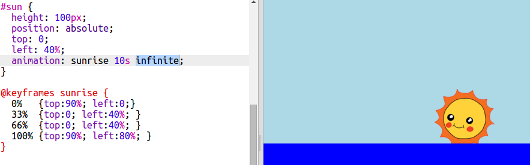

## Animación infinita

Hagamos que la animación se siga repitiendo para siempre.

+ Si quieres que el sol salga y luego se ponga, añade más keyframes a tu animación:
    
        @keyframes sunrise {
            0%  
            33% 
            66% 
            100%
        }
        
    
    Esto significa que la animación empieza y acaba con el sol al final del cielo y se queda en lo más alto desde el 33% hasta el 66% de la animación.

+ Ahora solo necesitas añadir la palabra `infinite` a la animación `#sun` para hacer un bucle infinito:
    
    

+ Prueba tu animación. ¿Sigue el sol saliendo y poniéndose?