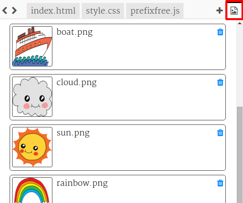

--- challenge ---

## Desafío: Más animación

¿Puedes animar otra imagen? Puedes animar la posición, color, forma, tamaño, opacidad o cualquier otra cosa en la que puedas pensar. También intenta cambiar el tiempo que duran tus animaciones.

Para cada objeto que quieras animar, necesitarás:

+ Incluirlo en tu HTML con un id
+ Añade un estilo para el id
+ Crea una regla @keyframes
+ Usa `animation:` en el estilo para usar la animación que definiste con @keyframes 

Haz clic en el icono de la imagen para ver las imágenes que están incluidas en el proyecto:



También puedes subir tus propias imágenes si así lo prefieres.

No olvides que puedes poner objetos tanto en el mar como en el cielo:


En el ejemplo el arco iris usa la opacidad para un efecto de desvanecimiento:
```
    @keyframes fade {
      0%  
      50% 
      66% 
      100%  
    }
```    

El barco usa un punto de partida negativo de manera que puedas verlo durante una parte de la animación:
```
     @keyframes left-right {
      0%   
      100% 
    }
```    

--- /challenge ---


**Traducción aportada por la comunidad**

Este proyecto fue traducido por **Asun Alsina** y revisado por **Juan Biondi**.

Nuestros increíbles voluntarios de traducción nos ayudan a dar a los niños de todo el mundo la oportunidad de aprender a programar. Puedes ayudarnos a llegar a más niños traduciendo nuestros proyectos. Consigue más información en [rpf.io/translate](https://rpf.io/translate).