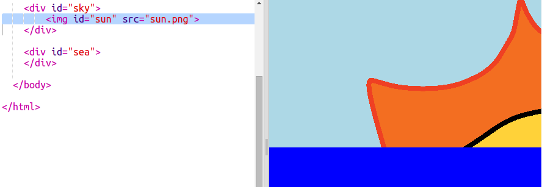

## Creando el Sol

Empecemos añadiendo una imagen para el sol y colocándola con CSS.

+ Abre este trinket: <a href="http://jumpto.cc/web-sunrise" target="_blank">jumpto.cc/web-sunrise</a>.
    
    El proyecto deberá parecerse a esto:
    
    

+ Mira dentro de `body` en tu archivo `index.html` y encontrarás los elementos `div` para el cielo y el mar.
    ```
        <div id="sky">
        </div>
        
        <div id="sea">
        </div>
    ```    

+ La imagen del sol ya está incluida en tu proyecto.
    
    Añade la imagen dentro de tu sol `div` incluyendo un id para darle diferentes estilos:
    
    

+ ¡Vaya! La imagen es enorme. Ve a `style.css` y añade el código CSS para establecer la altura de la imagen:
    
    
    
    Ten en cuenta que el ancho se actualiza automáticamente para mantener iguales las proporciones.

+ Finalmente, vamos a añadir algo de código para colocar el sol:
    
    