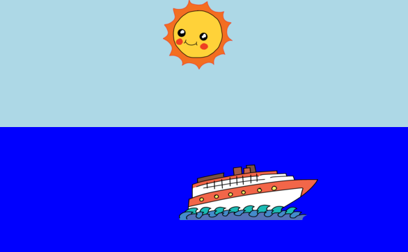

## परिचय

In this project, you'll learn how to use CSS to create an animated sunrise.

  <iframe src="https://trinket.io/embed/html/abcc0284a3?outputOnly=true&start=result" width="600" height="400" frameborder="0" marginwidth="0" marginheight="0" allowfullscreen>
  </iframe>
  

### क्लब लीडरों के लिए अतिरिक्त जानकारी

यदि आप इस प्रोजेक्ट को प्रिंट करना चाहते हैं, तो कृपया [प्रिंटर अनुकूल संस्करण](https://projects.raspberrypi.org/en/projects/sunrise/print) का उपयोग करें।

## \--- collapse \---

## title: क्लब नेता नोट्स

## परिचय:

In this project, children will to learn how to animate a simple scene using CSS. They will use the CSS @keyframes rule to animate various properties of images and divs.

## ऑनलाइन संसाधन

We recommend using [trinket](https://trinket.io/) to write HTML & CSS online. This project contains the following trinkets:

+ ['Sunrise' starting point](https://trinket.io/html/web-sunrise)

Children can also make use of this blank trinket [(jumpto.cc/html-blank)](http://jumpto.cc/html-blank) to write their own HTML & CSS, or alternatively they can use this template trinket [(jumpto.cc/html-template)](http://jumpto.cc/html-template).

There is also a trinket containing a sample solution to the challenges:

+ ['Sunrise' Finished](https://trinket.io/html/abcc0284a3)

## ऑफ़लाइन संसाधन

This project can be [completed offline](../offline.html) if preferred. You can access the project resources by clicking the 'Download Project Materials' link for this project. This link contains a 'Project Resources' folder, which includes resources that children will need to complete this project offline. सुनिश्चित करें कि प्रत्येक बच्चे को इन संसाधनों की प्रतिलिपि तक पहुँच प्राप्त होती है। This folder includes the following files:

+ template/index.html
+ template/prefix.js
+ template/style.css
+ sunrise/index.html
+ sunrise/style.css
+ sunrise/prefixfree.js
+ sunrise/boat.png
+ sunrise/cloud.png
+ sunrise/helicopter.png
+ sunrise/rainbow.png
+ sunrise/sun.png

You can also find a completed version of this project's challenges in the 'Volunteer Resources' section, which contains:

+ sunrise-finished/index.html
+ sunrise-finished/style.css
+ sunrise-finished/prefixfree.js
+ sunrise-finished/boat.png
+ sunrise-finished/sun.png
+ sunrise-finished/rainbow.png

## सीखने के उद्देश्य

+ Styling and animation with CSS: 
    + Introducing `@keyframes` rule for defining steps in an animation.
    + Reinforcing the use of properties to define the size, shape, position and colour of elements on a webpage.

इस प्रोजेक्ट में [Raspberry Pi डिजिटल निर्माण पाठ्यक्रम](http://rpf.io/curriculum) के निम्नलिखित पहलुओं के तत्व सम्मिलित हैं:

+ [Design basic 2D and 3D assets](https://www.raspberrypi.org/curriculum/design/creator).

## चुनौतियाँ

+ "Diagonal animation" - editing animation `@keyframe` properties to use left:;
+ "Improve the sky" - add more keyframes and setting background:.
+ "More animation" - animate more images or elements using a variety of CSS properties. 

## अक्सर पूछे जाने वाले प्रश्न

+ This project makes use of the javascript `prefixfree.js` library, to allow animation compatibility between browsers. If this library isn't used, then children using older browsers will instead need to declare an animation for their browser, for example:

    animation: sky 10s infinite;            //for all newer browsers
    -webkit-animation: sky 10s infinite;    // For Webkit browsers(Chrome, Safari...)
    -moz-animation: sky 10s infinite;       // For Mozilla browsers
    -o-animation: sky 10s infinite;         // For Opera browsers
    -ms-animation: sky 10s infinite;        // For Microsoft browsers 
    

\--- /collapse \---

## \--- collapse \---

## title: प्रोजेक्ट सामग्री

## प्रोजेक्ट संसाधन

+ [सभी प्रोजेक्ट संसाधनों वाली .zip फ़ाइल](resources/sunrise-project-resources.zip)
+ [Online Trinket containing all 'Sunrise' project resources](http://jumpto.cc/web-sunrise)
+ [Online Trinket template](http://jumpto.cc/trinket-template)
+ [Online blank Trinket](http://jumpto.cc/trinket-blank)
+ [template/index.html](resources/template-index.html)
+ [template/style.css](resources/template-style.css)
+ [intro/index.html](resources/intro-index.html)
+ [intro/style.css](resources/intro-style.css)
+ [sunrise/index.html](resources/sunrise-index.html)
+ [sunrise/style.css](resources/sunrise-style.css)
+ [sunrise/prefixfree.js](resources/sunrise-prefixfree.js)
+ [sunrise/sun.png](resources/sunrise-sun.png)
+ [sunrise/rainbow.png](resources/sunrise-rainbow.png)
+ [sunrise/cloud.png](resources/sunrise-cloud.png)
+ [sunrise/boat.png](resources/sunrise-boat.png)
+ [sunrise/helicopter.png](resources/sunrise-helicopter.png)

## क्लब नेता संसाधन

+ [सभी प्रोजेक्ट संसाधनों वाली .zip फ़ाइल](resources/sunrise-volunteer-resources.zip)
+ [ऑनलाइन पूर्ण Trinket प्रोजेक्ट](https://trinket.io/html/abcc0284a3)
+ [sunrise-finished/index.html](resources/sunrise-finished-index.html)
+ [sunrise-finished/style.css](resources/sunrise-finished-style.css)
+ [sunrise-finished/prefixfree.js](resources/sunrise-finished-prefixfree.js)
+ [sunrise-finished/sun.png](resources/sunrise-finished-sun.png)
+ [sunrise-finished/boat.png](resources/sunrise-finished-boat.png)
+ [sunrise-finished/rainbow.png](resources/sunrise-finished-rainbow.png)

\--- /collapse \---