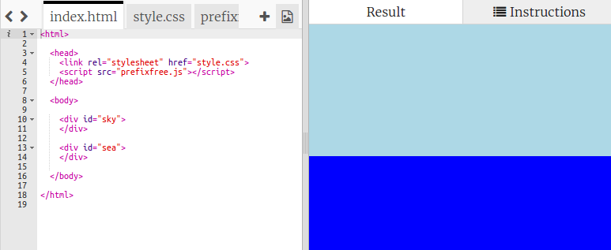

## सूर्य बनाना

चलिए सूर्य के लिए एक चित्र शामिल करने और इसे CSS द्वारा एक स्थिति में लाने से आरंभ करें।


+ इस ट्रिंकेट को खोलें: <a href="http://jumpto.cc/web-sunrise" target="_blank">jumpto.cc/web-sunrise</a>. 

    प्रोजेक्ट कुछ इस प्रकार दिखाई देना चाहिए:

	

+ अपनी `index.html` फाइल के `body` के भीतर देखें और आपको आकाश और समुद्र के लिए `div` एलिमेंट्स दिखाई देंगे।

    ```
    <div id="sky">
    </div>
    
    <div id="sea">
    </div>
    ```

+ सूर्य का एक चित्र पहले से ही आपके प्रोजेक्ट में शामिल है।। 

    आपके सूर्य `div` में चित्र शामिल करें जिसमें एक id शामिल हो ताकि आप इसे स्टाइल दे सकें:

    

+ वाह, चित्र बड़ा है। `style.css` पर जाएँ और चित्र की ऊंचाई निर्धारित करने के लिए CSS शामिल करें:

    

    ध्यान दें कि अनुपात को बराबर रखने के लिए चौड़ाई स्वयं ही अपडेट हो जाती है। 

+ अंततः चलिए सूर्य को एक स्थिति में लाने के लिए कुछ कोड शामिल करें:

    


