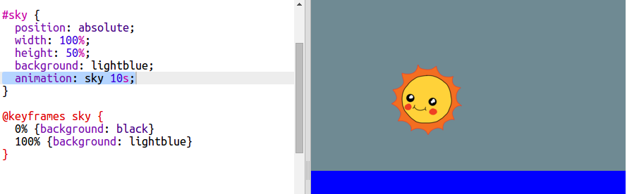

## आकाश को एनिमेट करना

एनीमेशन सिर्फ आंदोलन के लिए नहीं है। आकाश को चेतन करो ताकि रात को अंधेरा हो जाए।

+ ` SKY ` एनीमेशन जोड़ें अपने CSS के लिए:
    
        @keyframes sky {
            0%
            100%
        }
        
    
    ध्यान दें कि इस बार आप आकाश के रंग को नहीं बल्कि स्थिति को एनिमेट कर रहे हैं

+ अपने नए एनीमेशन का उपयोग करने के लिए इसे अपने आकाश में कोड जोड़ें:
    
        animation: sky 10s;
        
    
    

+ अपने एनीमेशन का जाँच करने के लिए **Autorun** पर क्लिक करें।