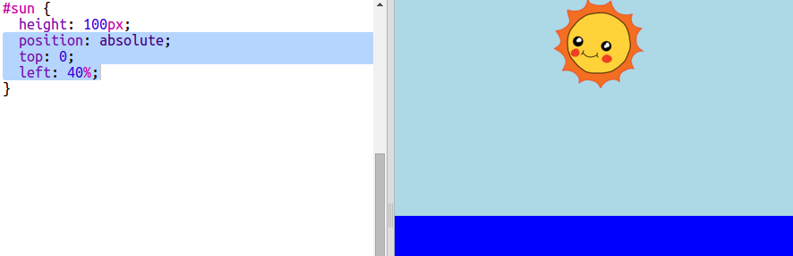

## Stvaranje sunca

Počni s dodavanjem slike sunca i pozicioniranjem slike pomoću CSS-a.

+ Otvori ovaj trinket: <a href="http://jumpto.cc/web-sunrise" target="_blank">jumpto.cc/web-sunrise</a>.
    
    Projekt bi trebao izgledati ovako:
    
    

+ Pogledaj unutar `tijela (body)` svoje `index.html` datoteke i pronaći ćeš `div` elemente za nebo (sky) i more (sea).
    
        

        

        
        

        

        

+ Slika sunca već je uključena u tvoj projekt.
    
    Dodaj sliku unutar `div` elementa svog sunca. Uključi i id svojstvo da ju možeš oblikovati:
    
    

+ Uh, slika je ogromna. Klikni na `style.css` i dodaj CSS svojstvo za postavljanje visine slike:
    
    
    
    Primijeti kako se širina automatski ažurira kako bi proporcije slike bile iste.

+ Napokon, dodaj kôd kojim ćeš pozicionirati sunce:
    
    