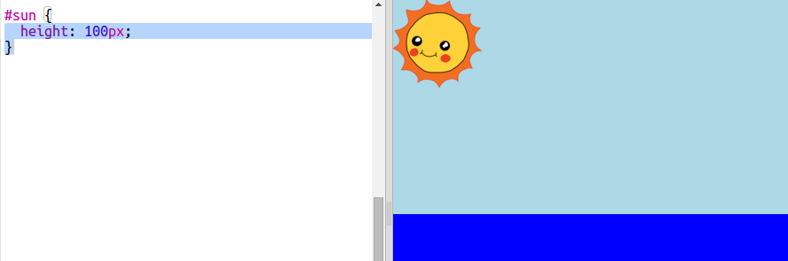

## Creating the sun

Let's start by adding an image for the sun and positioning it with some CSS.

+ Trinketをひらく: <a href="http://jumpto.cc/web-sunrise" target="_blank">jumpto.cc/web-sunrise</a>.
    
    プロジェクトはこのようになります。
    
    

+ Look inside the `body` of your `index.html` file and you'll find the the `div` elements for the sky and the sea.
    
        

        

        
        

        

        

+ An image for the sun is already included in your project.
    
    Add the image inside your sun `div` including an id so you can style it:
    
    

+ Whoa, the image is huge. Go to `style.css` and add the CSS to set the image height:
    
    
    
    Note that the width is updated automatically to keep the proportions the same.

+ Finally, let's add some code to position the sun:
    
    