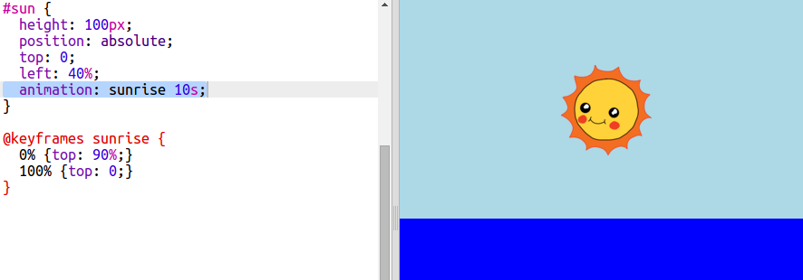

## 일출 애니메이션

일출을 애니메이션화하려면, 해가 움직이고 뜨는 데 얼마나 걸리는 지를 지정해야 합니다.

이러한 일을 하기위해 **key frames**의 리스트를 정의해야 합니다. 각 key frame은 애니메이션의 특정 지점에서 요소의 CSS 속성을 정의합니다.

+ 먼저, `@keyframes`을 사용하여 일출이라 불리는 애니메이션을 만들어야합니다.
    
    아래 CSS 코드를 `style.css` 끝 부분에 추가합니다.
    
        @keyframes sunrise {
            0%
            100%
        }
        
    
    이 코드는 해 애니메이션의 시작점(`0%`) 과 끝점(`100%`) 위치를 지정하는 용도로 사용됩니다.
    
    당신이 준 `div` , `top`, `left`의 위치가 하늘 안에 존재했기 때문에 하늘에 해가 있다. `top: 100%`은 그림의 밑부분이 아니라 하늘의 밑바닥이다.

+ 이제 `sunrise` 애니메이션을 만들었으니, 사용하라는 명령만 내리면 됩니다!
    
    아래 강조된 코드를 sun의 CSS에 추가합니다.
    
    
    
    이 코드는 애니메이션을 실행하는데 10초가 걸리도록 지정하는 코드입니다.

+ Trinket에서 애니메이션을 다시 실행하고 싶다면, **Autorun**을 누르세요.