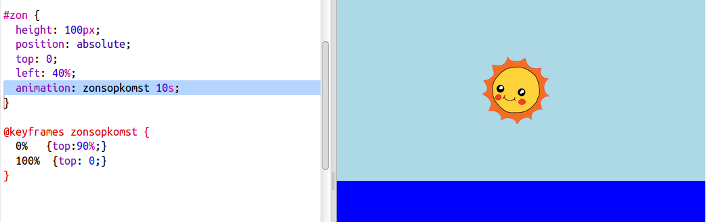

## Animatie van de zonsopgang

Om je zonsopgang te animeren, moet je bepalen hoe de zon beweegt en hoe lang het duurt om op te komen.

Daarvoor definieer je een lijst met **sleutelframes**. Elk sleutelframe definieert de CSS-eigenschappen van een element op een bepaald punt in een animatie.

+ Eerst moet je `@keyframes` gebruiken om een ​​nieuwe animatie met de naam zonsopkomst te maken.
    
    Voeg deze CSS-code toe aan het einde van je `style.css` bestand:
    
        @keyframes zonsopkomst {
            0%
            100%
        }
        
    
    Deze code vertelt de zon waar hij zichzelf moet positioneren aan het begin (`0%`) en het einde (`100%`) van de animatie.
    
    Omdat de zon zich in de lucht-`div` bevindt, zijn de `top` en `left` posities de posities die je binnen de lucht geeft, zodat `top: 100%` de onderkant van de lucht aangeeft, en niet de onderkant van de webpagina.

+ Nu je een `zonsopkomst` animatie hebt gemaakt, hoef je alleen maar je zon te vertellen om hem te gebruiken!
    
    Voeg de gemarkeerde code toe aan de CSS van je zon:
    
    
    
    Dit vertelt de zon om 10 seconden te besteden aan het animeren van een zonsopgang.

+ Klik **Autorun** om de animatie opnieuw in Trinket uit te voeren.