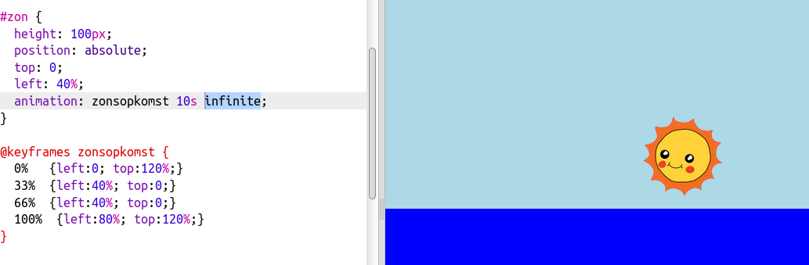

## Doorlopende animatie

Laten we de animatie voor altijd blijven herhalen.

+ Als je wilt dat de zon opkomt en vervolgens aan de hemel blijft staan, voeg je gewoon sleutelframes toe aan je animatie:
    
        @keyframes sunrise {
            0%  
            33% 
            66% 
            100%
        }
        
    
    Dit betekent dat de animatie begint en eindigt met de zon aan de onderkant van de hemel en van 33% tot 66% van de animatie boven in de lucht blijft.

+ Nu hoef je alleen maar het woord `infinite (oneindig)` toe te voegen aan de `#sun` animatie om de lus steeds te herhalen:
    
    

+ Test je animatie. Blijft de zon op- en ondergaan?