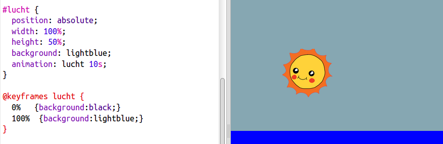

## De lucht animeren

Animatie is niet alleen voor beweging. Laten we de lucht animeren zodat deze 's nachts donker wordt.

+ Voeg een animatie met de naam `sky` toe aan je CSS:
    
        @keyframes sky {
            0%
            100%
        }
        
    
    Merk op dat je deze keer de kleur van de lucht animeert, en niet de positie.

+ Voeg code toe aan je lucht, om het te vertellen om je nieuwe animatie te gebruiken:
    
        animation: sky 10s;
        
    
    

+ Klik op **Autorun** om je animatie te testen.