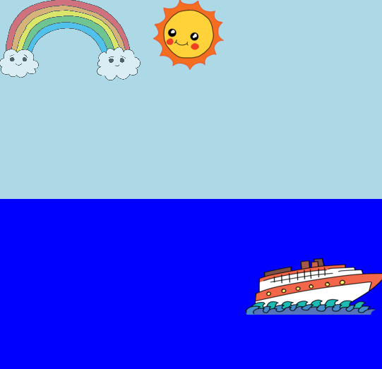

--- challenge ---

## Wyzwanie: więcej animacji

Czy potrafisz stworzyć animację kolejnego obrazka? Możesz wybrać, co chcesz animować, czy to pozycję, kolor, kształt, rozmiar, przezroczystość. Spróbuj zmieniać również czas trwania twoich animacji.

W przypadku każdego elementu, który chcesz animować, musisz:

+ Dodać w kodzie HTML identyfikator
+ Dodać styl CSS do elementu z identyfikatorem
+ Stworzyć definicję klatek przy wykorzystaniu zasady @keyframes
+ Użyć właściwości `animation: ` w stylu, który został przez ciebie zdefiniowany przy użyciu @keyframes 

Kliknij na ikonę obrazka, żeby zobaczyć obrazki już dodane do projektu:

Możesz dodać własne obrazki, jeśli chcesz.

Nie zapomnij, że możesz dodawać elementy na morzu, jak i na niebie:

W przypadku animacji tęczy, wykorzystamy przezroczystość, aby stworzyć efekt rozmycia:

    @keyframes fade {
      0%  
      50% 
      66% 
      100%  
    }
    

Łódka znajduje się w ujemnej pozycji początkowej, tak, aby nie była widoczna w pierwszej części animacji:

     @keyframes left-right {
      0%   
      100% 
    }
    

--- /challenge ---

### Tłumaczenie wykonane przez wolontariuszy 

Projekt ten przetłumaczyła **Ewa Urbaniak** a zweryfikował **Paweł Wilk**.

Dzięki naszym wspaniałym wolontariuszom, ludzie na całym świecie mogą nauczyć się kodowania. Tłumacząc nasze projekty możesz pomóc nam dotrzeć do większej liczby ludzi. Więcej informacji na stronie [rpf.io/translate](https://rpf.io/translate).