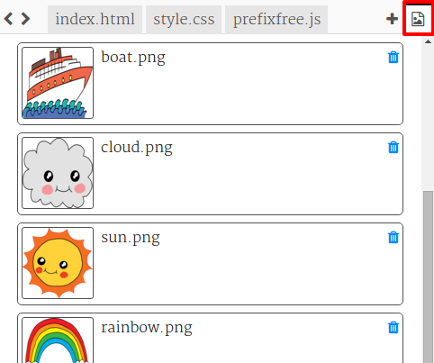

\--- challenge \---

## Desafio: Mais animações

Você pode animar outra imagem? Você pode animar a posição, a cor, a forma, o tamanho, a opacidade (transparência) ou qualquer outra coisa em que possa pensar. Também tente alterar a quantidade de tempo que suas animações são executadas.

Para cada item que você deseja animar, você precisará:

+ Inclua no seu HTML com um id
+ Adicione um estilo para o id
+ Crie uma regra @keyframes
+ Use `animation: ` no estilo para usar a animação que você definiu no @keyframes 

Clique no ícone da imagem para ver as imagens incluídas no projeto:

Você também pode enviar suas próprias imagens, se você desejar.

Não esqueça que você pode colocar itens no mar e no céu:

No exemplo, o arco-íris usa a opacidade para ter um efeito de transparência:

    @keyframes fade {
      0%  
      50% 
      66% 
      100%  
    }
    

O barco usa uma posição inicial oculta para que você não possa vê-lo antes de iniciar a animação:

     @keyframes left-right {
      0%   
      100% 
    }
    

\--- /challenge \---