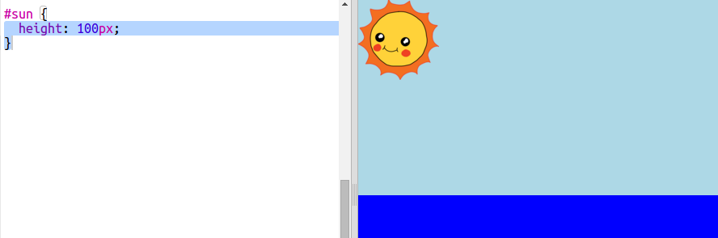

## Створення сонця

Почнемо з додавання зображення для сонця та позиціонування його за допомогою CSS.

+ Відкрий цей trinket: <a href="http://jumpto.cc/web-sunrise" target="_blank">jumpto.cc/web-sunrise</a>.
    
    Проєкт повинен виглядати так:
    
    

+ Подивися всередину елементу `body` файлу `index.html`, і ти знайдеш елементи `div` для неба та моря.
    
        

        

        
        

        

        

+ Зображення для сонця вже включено в твій проєкт.
    
    Додай зображення у відповідний елемент `div` разом з ідентифікатором (id), щоб ти міг змінювати його вигляд:
    
    

+ Ого, зображення величезне. Перейди у `style.css` і додай код CSS, щоб встановити висоту зображення:
    
    
    
    Зверни увагу, що ширина змінюється автоматично, щоб зберегти пропорції.

+ Нарешті, давай додамо код для розміщення сонця:
    
    