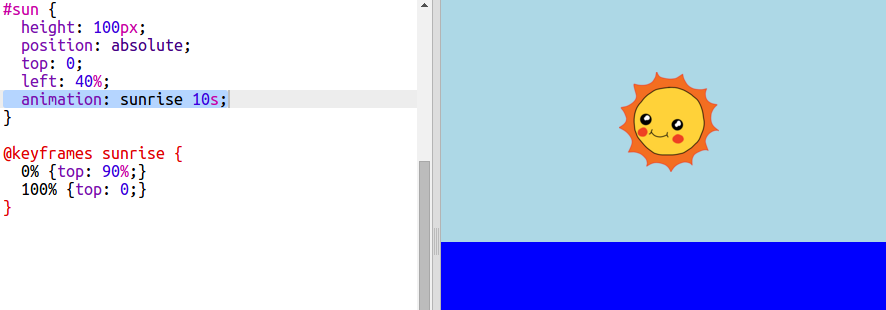

## Анімація сходу сонця

Щоб анімувати схід сонця, потрібно визначити, як рухається сонце і скільки часу воно піднімається.

Для цього ви визначаєте список основних кадрів. Кожен ключовий кадр визначає властивості CSS елемента в певній точці анімації.

+ Спочатку, ви повинні використати `@keyframes` щоб створити нову анімацію сходу сонця.
    
    Додайте цей код CSS в кінці свого style.css файлу : 
    
        @keyframes sunrise {
            0%
            100%
        }
        
    
    Цей код повідомляє Сонце, де розташовувати себе на початку (`0%`) та кінці (`100%`) анімації.
    
    Оскільки сонце знаходиться всередині неба `div`, то `top` та `left` позиції, які ви даєте в межах до неба, при `top: 100 %` - це нижня частина неба, а не нижня частина веб-сторінки.

+ Тепер, коли ви створили анімацію sunrise , вам просто потрібно сказати своєму сонцю користуватися ним!
    
    Додайте виділений код до вашого сонця CSS :
    
    
    
    Це говорить про те, що сонце проведе 10 секунд, на анімованому сході сонця.

+ Щоб знову запустити анімацію в Trinket, просто натисніть **Autorun**.