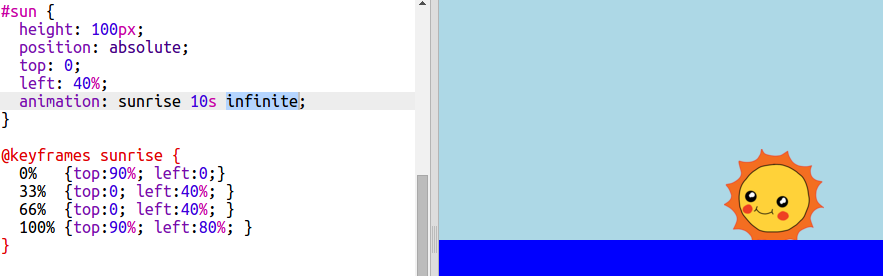

## Безмежна мультиплікація

Давайте зробимо мультиплікацію, яка буде повторюватися.

+ Якщо ви хочете, щоб сонце піднімалося і сідало, просто додайте додаткові ключові кадри до вашої мультиплікації:
    
        @keyframes sunrise {
            0%  
            33% 
            66% 
            100%
        }
        
    
    Це означає, що мультиплікація починається і закінчується сонцем у нижній частині неба, і залишається на вершині з 33% до 66% мультиплікації.

+ Тепер вам просто потрібно додати слово `infinite` до `#sun` мультиплікації, щоб це було назавжди:
    
    

+ Випробуйте свою мультиплікацію. Чи піднімається і сідає сонце?